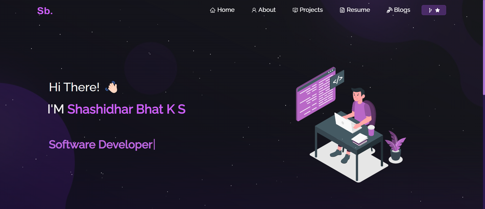

<h2 align="center">
  Portfolio Website - v2.0 
  <a href="https://shashi-portfolio-qe37q782e-shashidhar-bhats-projects.vercel.app/" target="_blank">shashi-portfolio.com</a>
</h2>

  

 

 &nbsp;
 &nbsp;
 &nbsp;
 &nbsp;

<h3 align="center">
    🔹
    <a href="https://github.com/Shashidhar-bhat/Portfolio/issues">Report Bug</a> &nbsp; &nbsp;
    🔹
    <a href="https://github.com/Shashidhar-bhat/Portfolio/issues">Request Feature</a>
</h3>

## TL;DR

You can fork this repo to modify and make changes of your own. Please give me proper credit by linking back to Shashi
(https://github.com/Shashidhar-bhat/Portfolio). Thanks!

## Built With

My personal portfolio <a href="https://shashi-portfolio-qe37q782e-shashidhar-bhats-projects.vercel.app/" target="_blank">Shashi</a> which features some of my GitHub projects as well as my resume and technical skills. 

This project was built using the following technologies:

- React.js
- Node.js
- Express.js
- CSS3
- VsCode
- Vercel

## Features

**📖 Multi-Page Layout**

**🎨 Styled with React-Bootstrap and CSS with easy-to-customize colors**

**📱 Fully Responsive**

## Getting Started

Clone this repository. You will need `node.js` and `git` installed globally on your machine.

## 🛠 Installation and Setup Instructions

1. **Installation:** `npm install`
2. **Run the project:** `npm start`

This runs the app in development mode. 
Open [http://localhost:3000](http://localhost:3000) to view it in the browser. The page will reload if you make edits.

## Usage Instructions

Open the project folder and navigate to `/src/components/`.  
You will find all the components used, and you can edit your information accordingly.

### Show Your Support

Give a ⭐ if you like this website!

